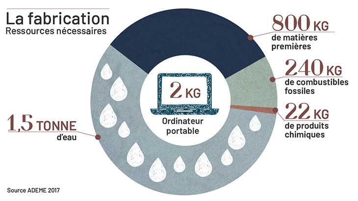

---


&nbsp;


&nbsp;


&nbsp;


&nbsp;


&nbsp;


&nbsp;


&nbsp;


&nbsp;


&nbsp;

&nbsp;


&nbsp;


&nbsp;


A l'heure où les débats sur l'environnement sont de plus en plus présents, **le numérique est pointé du doigt**.
En effet, son impact environnemental telle que la pollution numérique est un sujet au coeur de l'actualité. 

Mais avant de discuter de ce sujet, il est utile de comprendre le numérique. 
Au milieu du XXème siècle, **l’ère du numérique a démarré avec l’apparition de la technologie de l’information**. Petit à petit, les nouvelles technologies ont modifié l’industrie traditionnelle mise en place lors de la révolution industrielle.
En fait, l’apparition de cette ère est en corrélation avec les nombreux développements de la technologie de l’information et de la communication comme les développements des transistors. Cela a permi l'invention du microprocesseur qui constitue le composant actif le plus important des circuits électroniques nécessaires notamment au fonctionnement du matériel informatique. [@wikipedia_ere_2022]


**Ces évolutions ont permis:**

*	D’avoir un accès immédiat aux informations
*	D’avoir un accès à de très grandes quantités d’informations
*	De stocker ses données
*	De partager et transmettre ses données
*	De dématérialiser des processus, autrement dit de produire directement les informations au format numérique à partir d’un système d’information ce qui ne nécessite pas de support physique. 
*	Ect…


Alors que les technologies de l’information et de la communication se développent, la pollution numérique émerge et devient un problème majeur de l’ère du numérique.
Bien que les impacts ne sont pas visibles directement, le numérique représente une part importante de la pollution nationale et mondiale.

# Qu'est ce que la pollution numérique?
En quelques mots, **toutes les formes de pollution pouvant être engendrées par le secteur informatique constituent la pollution numérique.** 
Dans le secteur informatique, il existe de très nombreuses activités numériques tels que les différentes technologies de l'information et de la communication. Elles peuvent être matériels ou immatériels. Souvent, ces activités ne sont pas visibles.
Même si ces activités ont entrainé des évolutions majeures permettant parfois l'amélioration des conditions de vie, elles sont aussi sources d'impacts sur l'environnement. Cela est appelé la pollution numérique.
Celle-ci peut également être importée:**c'est la pollution importée.** Par exemple, la France est responsable de pollution importée puisque de nombreuses activités de fabricationn se font en dehors de ses territoires.

Il existe différents types d'activités du numérique et la pollution numérique peut se caractériser différement.


# Les activités du numérique
Les activités numériques ne sont pas les mêmes en fonction du cycle de vie d'un appareil. 
En fait, il est possible de considérer **3 phases dans le cycle de vie d'un appareil numérique**:

* La fabrication
* L'utilisation
* La fin de vie

Ci dessous, nous allons voir les étapes ont des impacts différents. Il est à noter que **c'est l'étape de la fabrication qui pollue le plus**: que les appareils soient petits ou gros.


**Les impacts environnementaux des activités du numérique [@arcep_empreinte_2023] :**

*	**70%** des impacts environnementaux : les appareils numériques (ou terminaux) (écrans, téléviseurs, …)
*	**20%** des impacts environnementaux : les centres de données
*	**10%** des impacts environnementaux : les réseaux

```{r setup, include=TRUE}
knitr::opts_chunk$set(echo = FALSE, eval= TRUE)
library(scales)
valeurs <- c(0.70, 0.20, 0.10)

pie<-pie(valeurs,
    col=c("#AAFFAA","#FFEE44","#FFAAAA"), 
    main = "Répartion des impacts du numérique en fonction des secteurs d'activités",
    col.main="red",
    cex.main=1,
    cex=1, 
    label= percent(valeurs))
legend(x="bottomright", legend=c("Appareils numériques","Centre de données","Réseaux"), cex=0.8,fill=c("green","orange","red"))
```

## Les appareils numériques
Comme indiqué ci-dessus, ce sont les terminaux qui ont le plus gros impact environnemental. Les terminaux, appelés également appareils numériques sont des unités distantes connectées à un réseau informatique ou à des applications.[@wikipedia_terminal_2023]
Des exemples de terminaux :

* Ordinateurs de bureaux
*	Ordinateurs portables
*	Téléviseurs
*	Smartphones
*	Smartwatches
*	Serveurs
*	Etc….

Les appareils numériques polluent tout au long de leur cycle de vie : de leur fabrication à leur fin de vie.
A**vec une émission de 78% de CO2, la fabrication des terminaux numériques est le principal émetteur de CO2 [@inoxia_fabrication_2021].**

Pour fabriquer des appareils, de nombreux éléments sont nécessaires comme :

*	Des ressources : des métaux en provenance du monde entier
*	De l’eau pour extraire les minerais
*	De l’énergie

<center>
{#id .class width=50%, height=50%}
</center>

Ainsi, comme nous le voyons sur l'image si dessus, pour fabirquer un ordinateur de 2 kg, les ressources utilisées sont colossales. Qu'un objet soit plus petit ne diminue pas forcémement le besoin en ressource: la fabrication est plus complexe.
Il est important de noter que parmi les matières premières, il y a de nombreux minerais, parfois rare.
Et, la fabrication nécessite de l'énergie qui est généralement pas renouvelable.

## Les centres de données
Les centres de données sont des infrastructures physiques (des lieux) permettant de stocker, de traiter et de partager de données immatérielles. Ces lieux regroupent des équipements constituants d’un système d’information tels que les ordinateurs, les serveurs, … C’est un lieu très sécurisé.
Ces lieux fonctionnent de jour comme de nuit pour pouvoir répondre aux attentes du consommateur. 
Pour pouvoir fonctionner, les centres de données utilisent de l’électricité mais également des systèmes de climatisation pour éviter la surchauffe du matériel. 

Ainsi les data-center consomment beaucoup d’énergie et d'électricité.  [@dumont_quelle_2022].
D'après la commission Européenne, en 2015, **les datas centers consommaient 4% de la consommation globale en energie dans le monde**. Ce chiffre est en augmentation.[@sana_datacenters_2021]

## Les réseaux
En réalité, les réseaux ne sont pas que immatériels. Pour qu’ils fonctionnent, il est nécessaire d’avoir de nombreux équipements informatiques comme des câbles, antennes, appareils numériques.[@wikipedia_reseau_2023]

**Afin de pouvoir échanger entre différents appareils numériques, il est nécessaire qu'ils soient connectés entre eux: par fil ou non.**[@cite_des_telecoms_reseau_nodate]

Lorsque qu’un individu fait des recherches sur le réseau, il consomme de l’énergie.

# Les différents impacts environnementaux du numérique

## Les émissions de gaz à effet de serres
Tout au long de leur vie, les appareils numériques émettent d’importantes émissions de CO2. **Actuellement, ils sont responsables de 2 % au niveau national et de 4% au niveau international des émissions de gaz à effet de serre [@gouvernement_ministeres_nodate].**C’est plus que le domaine de l’aviation civile.
**Qu’est-ce que la gaz à effet de serre ?**
C’est un gaz présent dans l’atmosphère qui retient une partie de la chaleur reçue des rayons solaires. Celui-ci est indispensable à la vie sur terre mais une augmentation trop importante entraine une hausse de température.[@wikipedia_gaz_2023]

Dans le cas du numérique, les composants électroniques rejettent  des gaz fluorés comme le NF3 (trifluore d'azote) et participent donc à l'augmentation du gaz à effet de serre.

## La contamination chimique des eaux, des sols et de l'air
Afin de fabriquer les appareils numériques, l'industrie minière est sollicitée pour extraire différents minerais, plus ou moins rares. En effet, les composants électroniques peuvent être fabriqués grâce à de l'or, de l'étain, du tantale, du tungstène,...
Cependant, lors de leur extraction, il y a de nombreux rejets toxiques qui entrainent la contamination du milieu: eaux, sols et air.
Par exemple, les rivières de l'Amazonie sont pollués en partie à cause de l'industrie minière[@greenpeace_pollution_2023].

## L'érosion de la biodiversité et des sols
Afin de fabriquer les appareils numériques, des minerais sont recherchés. Ainsi, des mines se développent et détruisent leur environnement. Les sols sont détruits et de fait, la faune et la flore se déteriorent. Il y a une perte massive d'habitat.

## La production de déchet électronique
La filière de tri des déchets électroniques n'est pas développée ainsi il y a très peu de recyclage.
D'après ADEME, 78% des déchets électroniques sont recyclés à ce jour [@ademe_equipements_2019]. C'est une bonne évolution par rapport à 2013 où l'ONU estimait que 75% des déchets électroniques échappaient au recyclage et finissait dans des décharges à ciel ouvert en Chine, au Ghana ou ailleurs... 

# Comment réduire son impact environnemental à cause du numérique?
A ce jour, il est possible de réduire son impact sur l'environnement. En effet, de nombreux gestes du quotidien sont réalisables et à la portée de tous.[@improved_impact_pollution_2021]

Une liste est présentée mais il est évident qu'il y a encore de nombreux autres gestes possibles [@schleret_internet_2020]:

*	Essayer de conserver au maximum ses appareils: Selon l'ADEME, il est possible d'améliorer de 50% le bilan carbone d'une machine en passant de 2 à 4 ans.
En réalité, les personnes ont trop souvent tendance à remplacer leur appareil par un autre dès que celui-ci n'est plus récent ou q'une pièce est défectueuse. Or, dans la majorité des cas des appareils défectueux, il est possible de simplement remplacer une pièce.
* Ne pas toujours acheter neuf: de plus en plus de possibilités d'achat d'occasion ou de reconditionné existent aujourd'hui. Certes, les produits ne sont pas neufs mais dans la quasi totalité des cas, ce sont des appareils très opérationnels. Et surtout à des coûts plus interessant.
*	Privilégier l’utilisation de wifi par rapport aux partages de connexion: en effet, d'après l'Université de Columbia (USA), le partage de connexion consomme 23 fois plus que la wifi (energic). Ainsi, lorsqu'on que personne a la possibilité de passer en Wifi, c'est la connexion à priviligier.
*	Gérer les boites mails
*	Réduire le nombre de notification
*	Mieux gérer sa consommation streaming : plus la qualité de la vidéo sera élévée, plus la consommation d’énergie est importante. 
*	Eteindre les appareils connectés: lorsqu’une personne est absente de chez-elle, elle peut éteindre sa box.


---


&nbsp;


&nbsp;


&nbsp;


&nbsp;


&nbsp;


&nbsp;


&nbsp;


&nbsp;


&nbsp;

&nbsp;


&nbsp;


# Bibliographie


